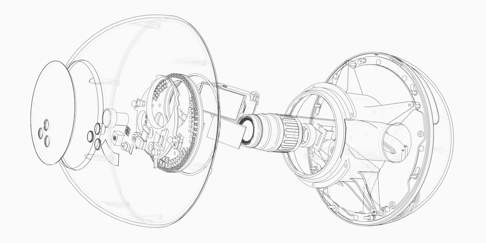

# orb-software

Open source software for [the orb][inside-orb].



## Repository structure

For the most part, every toplevel directory is a separate software component.
We also link to some other public repositories, to provide a unified view of
the orb's software. The most important applications on the orb are as follows:

- [orb-attest](orb-attest): Talks with the secure element to generate an
  attestation token for the signup backend service.
- [orb-core](https://github.com/worldcoin/orb-core): The core signup logic and
  sensor management of the orb.
- [orb-firmware](https://github.com/worldcoin/orb-firmware): The firmware for
  the orb's microcontrollers (MCUs). This excludes the firmware that runs on
  the security MCU.
- [orb-messages](https://github.com/worldcoin/orb-messages): Schemas for
  messages sent between the Jetson and the MCU.
- [orb-secure-element](https://github.com/worldcoin/orb-secure-element): Code
  that interacts with the orb's secure element - a dedicated security hardened
  chip that provides a hardware root of trust. Provides important signing
  functionality.
- [orb-ui](orb-ui): Daemon that manages the UI/UX of the orb.
- [open-iris](https://github.com/worldcoin/open-iris): The iris recognition
  inference system.

## Contributing

We plan to accept contributions at a later date, but do not have bandwidth to
review PRs currently.

Likewise, we are providing this source code for the benefit of the community,
but cannot commit to any SemVer or API stability guarantees. Be warned: we may
change things in a backwards-incompatible way at any time!

### Coding Guidelines

- Code must pass CI - see the github actions workflow for the most up to date
  checks.
- There can be no copyleft or closed source dependencies.
- Prefer using cargo [workspace inheritance] when possible.
- Prefer cross-platform code. Please consult [deps tests](deps-tests) for more
  info.
- Any binaries that do not run on all platforms must be documented as such in
  their README.md file and added to the tests in `deps-tests`.
- Use `#![forbid(unsafe_code)]` whenever possible. This narrows the surface
  area for debugging memory safety issues.
- Prefer the [nix crate][nix crate] for safe unix APIs instead of raw unsafe
  libc. PRs that use `libc` will be rejected if an equivalent safe function in
  `nix` exists.
- PR names and the final squashed commit that gets merged, should start with an
  area prefix, like `ir-camera:`. This helps disambigutate which part of the
  monorepo changed at a glance.

## First time Setup

1. [Install nix][nix]. This works for both mac and linux, windows is not
   supported.
3. Install direnv: `nix profile install nixpkgs#direnv`
2.  Ensure that you have these lines in your `~/.config/nix/nix.conf`:
    ```
    experimental-features = nix-command flakes
    max-jobs = auto
    ```
4. [Hook direnv](https://direnv.net/docs/hook.html) into your shell.
5. Tell direnv to use the nix flake with `cp .envrc.example .envrc`. You can
   customize this file if you wish. We recommend filling in your cachix token
   if you have one.
6. Follow the instructions on vendoring proprietary SDKs in the subsequent
   section.
7. Run `direnv allow` in the repository's root directory.
8. If you are on macos, run the following: ``` brew install dbus brew services
   start dbus ```

### Vendoring Proprietary SDKs

Although all of Worldcoin's code in this repo is open source, some of the
sensors on the orb rely on proprietary SDKs provided by their hardware vendors.
Luckily, these are accessible without any cost.

To get started, you will need to download these SDKs. The process for this
depends on if you are officially affiliated with Worldcoin.

#### If you have access to Worldcoin private repos

1. Create a [personal access token][pac] from github to allow you to use
   private git repos over HTTPS.
2. Append the following to your `~/.config/nix/nix.conf`:
   ```
   access-tokens = github.com=github_pat_YOUR_ACCESS_TOKEN_HERE
   ```
3. Test everything works so far by running `nix flake metadata
   github:worldcoin/priv-orb-core`. You should see a tree of info. If not, you
   probably don't have your personal access token set up right - post in
   #public-orb-software on slack for help.

#### If you don't have access to Worldcoin private repos

1. Go to https://developer.thermal.com and create a developer account.
2. Download the 4.1.0.0 version of the SDK (its in the developer forums).
3. Extract its contents, and note down the dir that *contains* the
   `Seek_Thermal_SDK_4.1.0.0` dir. Save this in an environment variable of your
   choice, such as `SEEK_SDK_OVERRIDE`.
4. modify your `.envrc` like this: `use flake --override-input seekSdk
   "$SEEK_SDK_OVERRIDE"`

## Building

We use `cargo zigbuild` for most things. The following cross-compiles a binary
in the `foobar` crate to the orb:

```bash
cargo zigbuild --target aarch64-unknown-linux-gnu --release -p foobar
```

## License

Unless otherwise specified, all code in this repository is dual-licensed under
either:

- MIT License ([LICENSE-MIT](LICENSE-MIT))
- Apache License, Version 2.0, with LLVM Exceptions
  ([LICENSE-APACHE](LICENSE-APACHE))

at your option. This means you may select the license you prefer to use.

Any contribution intentionally submitted for inclusion in the work by you, as
defined in the Apache-2.0 license, shall be dual licensed as above, without any
additional terms or conditions.

[nix]: https://nixos.org/download.html
[nix crate]: https://docs.rs/nix
[pac]: https://docs.github.com/en/authentication/keeping-your-account-and-data-secure/managing-your-personal-access-tokens#creating-a-fine-grained-personal-access-token
[workspace inheritance]: https://doc.rust-lang.org/cargo/reference/workspaces.html#the-package-table
[inside-orb]: https://worldcoin.org/blog/engineering/opening-orb-look-inside-worldcoin-biometric-imaging-device
