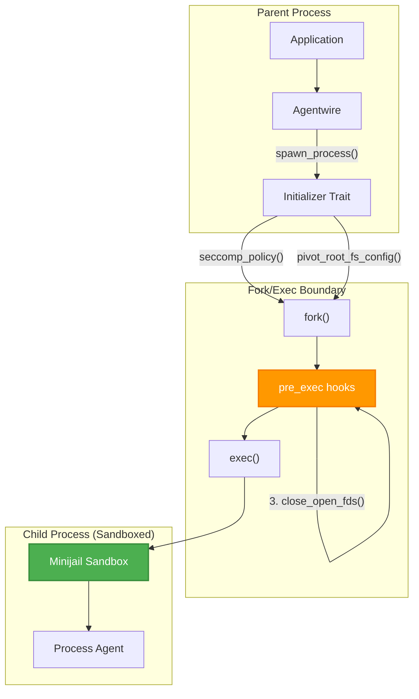
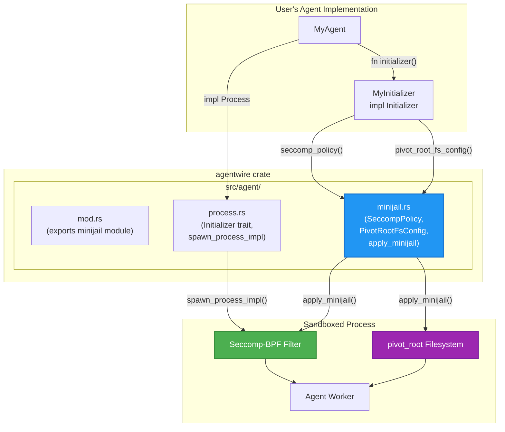
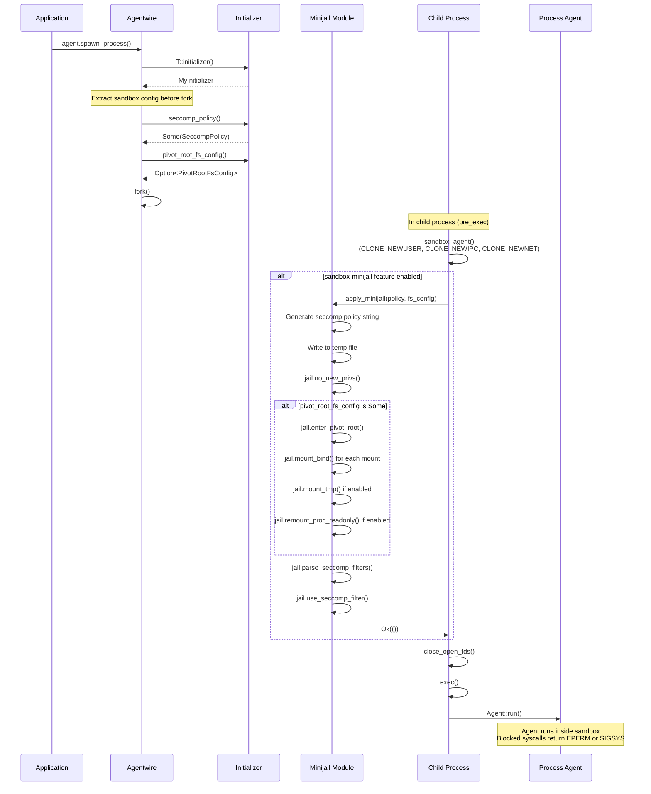

# Minijail-Based Process Agent Sandboxing

## Overview

This document describes the minijail integration in agentwire for sandboxing process-based agents. The sandbox uses Google's minijail to apply seccomp-BPF syscall filtering and optional filesystem isolation to process agents, providing defense-in-depth security for agents that handle sensitive operations or interact with third-party libraries.

## Table of Contents

- [Problem Statement](#problem-statement)
- [Why Minijail](#why-minijail)
- [Architecture](#architecture)
- [Feature Flags](#feature-flags)
- [Configuration](#configuration)
- [Seccomp Policy](#seccomp-policy)
- [Filesystem Isolation](#filesystem-isolation)
- [Implementation Details](#implementation-details)
- [Usage Examples](#usage-examples)
- [Security Considerations](#security-considerations)
- [Future Work](#future-work)

---

## Problem Statement

Agentwire's process-based agents run in separate OS processes, providing memory isolation from the main application. However, these processes still have full access to:

1. **Network syscalls** - Can create sockets and make network connections
2. **Filesystem** - Can read/write arbitrary files the process has permission to access
3. **Other syscalls** - Full access to Linux syscall interface

For agents that:

- Interact with third-party libraries (SDKs, codecs, ML models)
- Handle sensitive data (biometrics, credentials, PII)
- Run untrusted or partially-trusted code

We need additional isolation beyond process boundaries to limit what the agent can do, even if the code is compromised.

---

## Why Minijail

We chose [minijail](https://chromium.googlesource.com/chromiumos/platform/minijail) for several reasons:

### 1. Battle-Tested in Production

Minijail is developed by the ChromiumOS team and has been used to sandbox Chrome browser processes for over a decade. It's the same technology that isolates untrusted web content on millions of Chromebooks.

### 2. Seccomp-BPF Filtering

Minijail uses Linux seccomp-BPF to filter syscalls at the kernel level. The BPF bytecode runs in kernel space, making it impossible for userspace code to bypass:

- **Allowlist model**: Only explicitly permitted syscalls succeed
- **Configurable actions**: Block with EPERM, send SIGSYS signal, or kill process
- **Minimal overhead**: BPF runs in kernel with negligible latency

### 3. Rust Bindings Available

Minijail provides official Rust bindings, allowing clean integration with agentwire without FFI complexity.

### 4. No Root Required

Once a seccomp filter is installed, minijail enforces it entirely in userspace without requiring elevated privileges. The `NO_NEW_PRIVS` flag guarantees that the sandboxed process cannot escalate permissions.

### Comparison with Alternatives

| Approach | Pros | Cons |
|----------|------|------|
| **Network namespaces** (agentwire's `sandbox-network` feature) | Complete network isolation | Requires USER_NS, only isolates network |
| **Containers (Docker/Podman)** | Full isolation | Heavy runtime dependency, overhead |
| **LD_PRELOAD interception** | No kernel support needed | Bypassable, incomplete coverage |
| **Seccomp-BPF (minijail)** | Kernel-level enforcement, minimal overhead, flexible | Requires syscall enumeration |

**Best approach**: Combine network namespaces with seccomp-BPF for defense-in-depth.

---

## Architecture

The minijail integration hooks into agentwire's existing process agent spawning mechanism. When a process agent is spawned with minijail sandboxing enabled, the seccomp policy and optional filesystem restrictions are applied in the `pre_exec` hook after `fork()` but before `exec()`.

### Integration Point



### Component Diagram



### Sequence Diagram



---

## Feature Flags

The minijail integration is controlled by the `sandbox-minijail` Cargo feature:

```toml
# Cargo.toml
[dependencies]
agentwire = { version = "1.1.0", features = ["sandbox-minijail"] }
```

### Feature Combinations

| Feature | Description |
|---------|-------------|
| (none) | Basic process agents, no sandboxing |
| `sandbox-network` | Network namespace isolation (blocks network via `CLONE_NEWNET`) |
| `sandbox-minijail` | Seccomp-BPF syscall filtering + optional filesystem isolation |
| Both features | Defense-in-depth: namespace isolation + syscall filtering |

When both features are enabled, the sandboxing is applied in order:

1. Namespace isolation (`sandbox_agent()`)
2. Minijail seccomp + pivot_root (`apply_minijail()`)

---

## Configuration

### Initializer Trait Extensions

The `Initializer` trait is extended with two optional methods (feature-gated):

```rust
pub trait Initializer: Send {
    // Existing methods
    fn keep_file_descriptors(&self) -> Vec<RawFd>;
    fn envs(&self) -> Vec<(String, String)>;

    // Minijail methods (requires sandbox-minijail feature)
    #[cfg(feature = "sandbox-minijail")]
    fn seccomp_policy(&self) -> Option<SeccompPolicy> {
        None  // Default: no seccomp filtering
    }

    #[cfg(feature = "sandbox-minijail")]
    fn pivot_root_fs_config(&self) -> Option<PivotRootFsConfig> {
        None  // Default: no filesystem isolation
    }
}
```

### SeccompPolicy Structure

```rust
/// Configuration for seccomp-BPF syscall filtering.
pub struct SeccompPolicy {
    /// Syscalls to explicitly allow (unconditionally).
    pub allowed_syscalls: Vec<String>,

    /// Syscalls to block with a specified action.
    pub blocked_syscalls: Vec<(String, BlockAction)>,

    /// Action for syscalls not in allowed or blocked lists.
    /// Default is `Kill` which terminates the process immediately.
    pub default_action: DefaultAction,
}

/// Action to take when a blocked syscall is invoked.
pub enum BlockAction {
    /// Return specified errno (e.g., `libc::EPERM`).
    ReturnErrno(i32),
    /// Send SIGSYS signal.
    Trap,
    /// Immediately terminate the process.
    Kill,
}

/// Default action for unlisted syscalls.
pub enum DefaultAction {
    /// Allow but log to kernel audit (development only, NOT secure).
    Log,
    /// Immediately terminate the process (default).
    Kill,
}
```

### PivotRootFsConfig Structure

```rust
/// Configuration for filesystem isolation using pivot_root.
pub struct PivotRootFsConfig {
    /// New root directory for the sandboxed process.
    pub new_root: PathBuf,

    /// Bind mounts: (source, destination_within_new_root, writable).
    pub bind_mounts: Vec<(PathBuf, PathBuf, bool)>,

    /// Whether to mount a tmpfs at /tmp within the sandbox.
    pub mount_tmp: bool,

    /// Whether to remount /proc as read-only within the sandbox.
    pub remount_proc_readonly: bool,
}
```

---

## Seccomp Policy

### Policy Design Principles

1. **Allowlist model**: Only explicitly listed syscalls are allowed
2. **Graceful blocking**: Use `ReturnErrno(EPERM)` for syscalls that libraries might check
3. **Default kill**: Unlisted syscalls terminate the process immediately (use `Log` during development)
4. **Architecture-specific**: Syscall names vary by architecture (x86_64 vs aarch64)

### Example Policy for Network-Blocked Agent

```rust
fn seccomp_policy(&self) -> Option<SeccompPolicy> {
    Some(SeccompPolicy {
        allowed_syscalls: vec![
            // Memory management
            "brk", "mmap", "munmap", "mprotect", "mremap", "madvise",
            // File operations
            "openat", "close", "read", "write", "pread64", "pwrite64",
            "lseek", "newfstatat", "statx", "faccessat", "faccessat2",
            "getdents64", "fcntl", "dup", "dup3", "pipe2", "ioctl",
            // Process/thread
            "exit_group", "exit", "futex", "clone", "clone3",
            "set_tid_address", "set_robust_list", "rseq",
            "gettid", "getpid", "getppid", "prctl",
            // Signals
            "rt_sigaction", "rt_sigprocmask", "rt_sigreturn",
            // Time
            "clock_gettime", "clock_getres", "nanosleep",
            // IPC (for pre-passed FD communication)
            "sendto", "recvfrom", "sendmsg", "recvmsg",
            "getsockname", "setsockopt", "getsockopt",
            // Misc
            "getrandom", "uname", "getcwd",
        ].into_iter().map(String::from).collect(),

        blocked_syscalls: vec![
            // Block all socket creation/connection
            ("socket".into(), BlockAction::ReturnErrno(libc::EPERM)),
            ("connect".into(), BlockAction::ReturnErrno(libc::EPERM)),
            ("bind".into(), BlockAction::ReturnErrno(libc::EPERM)),
            ("listen".into(), BlockAction::ReturnErrno(libc::EPERM)),
            ("accept".into(), BlockAction::ReturnErrno(libc::EPERM)),
            ("accept4".into(), BlockAction::ReturnErrno(libc::EPERM)),
        ],

        // Use Log during development to discover missing syscalls,
        // then switch to Kill for production.
        default_action: DefaultAction::Kill,
    })
}
```

### Determining Required Syscalls

Use `strace` to enumerate syscalls your agent needs:

```bash
# Run agent under strace
strace -f -o /tmp/agent.strace ./my-agent

# Extract unique syscall names
awk -F'(' '{print $1}' /tmp/agent.strace | sort -u
```

---

## Filesystem Isolation

### When to Use pivot_root

Filesystem isolation via `pivot_root` is optional and should be used when:

- Agent handles sensitive data that shouldn't leak to filesystem
- Third-party libraries might read sensitive system files
- You want to restrict agent to a minimal filesystem view

### Example Configuration

```rust
fn pivot_root_fs_config(&self) -> Option<PivotRootFsConfig> {
    Some(PivotRootFsConfig {
        // New root directory (must exist)
        new_root: PathBuf::from("/var/lib/my-agent-sandbox"),

        // Bind mounts for required paths
        bind_mounts: vec![
            // Read-only access to shared libraries
            (PathBuf::from("/lib"), PathBuf::from("/lib"), false),
            (PathBuf::from("/usr/lib"), PathBuf::from("/usr/lib"), false),
            // Read-only access to agent's model files
            (PathBuf::from("/opt/models"), PathBuf::from("/models"), false),
            // Writable data directory
            (PathBuf::from("/var/lib/my-agent/data"), PathBuf::from("/data"), true),
        ],

        // Mount tmpfs at /tmp for temporary files
        mount_tmp: true,

        // Prevent proc-based information leaks
        remount_proc_readonly: true,
    })
}
```

---

## Implementation Details

### Module Structure

```
agentwire/src/agent/
├── mod.rs          # Exports minijail module (feature-gated)
├── process.rs      # Initializer trait, spawn_process_impl
├── minijail.rs     # SeccompPolicy, PivotRootFsConfig, apply_minijail
├── task.rs
└── thread.rs
```

### apply_minijail Function

The `apply_minijail` function is called in the `pre_exec` hook:

```rust
pub fn apply_minijail(
    seccomp_policy: &SeccompPolicy,
    pivot_root_fs_config: Option<&PivotRootFsConfig>,
) -> io::Result<()> {
    let mut jail = Minijail::new()?;

    // 1. Apply pivot_root filesystem isolation (if configured)
    if let Some(fs_config) = pivot_root_fs_config {
        jail.enter_pivot_root(&fs_config.new_root)?;
        for (src, dst, writable) in &fs_config.bind_mounts {
            jail.mount_bind(src, dst, *writable)?;
        }
        if fs_config.mount_tmp {
            jail.mount_tmp()?;
        }
        if fs_config.remount_proc_readonly {
            jail.remount_proc_readonly()?;
        }
    }

    // 2. Generate seccomp policy and write to temp file
    let policy_str = generate_seccomp_policy(seccomp_policy);
    let mut policy_file = tempfile::NamedTempFile::new()?;
    policy_file.write_all(policy_str.as_bytes())?;

    // 3. Prevent privilege escalation
    jail.no_new_privs();

    // 4. Parse and apply seccomp filter
    jail.parse_seccomp_filters(policy_file.path())?;
    jail.use_seccomp_filter();

    Ok(())
}
```

### Integration in spawn_process_impl

```rust
async fn spawn_process_impl<T: Process, ...>(...) {
    // ...
    let initializer = T::initializer();

    #[cfg(feature = "sandbox-minijail")]
    let seccomp_policy = initializer.seccomp_policy();
    #[cfg(feature = "sandbox-minijail")]
    let pivot_root_fs_config = initializer.pivot_root_fs_config();

    let mut child = unsafe {
        Command::new(exe)
            // ... configuration ...
            .pre_exec(sandbox_agent)  // Namespace isolation
            .pre_exec({
                #[cfg(feature = "sandbox-minijail")]
                let seccomp_policy = seccomp_policy.clone();
                #[cfg(feature = "sandbox-minijail")]
                let pivot_root_fs_config = pivot_root_fs_config.clone();

                move || {
                    #[cfg(feature = "sandbox-minijail")]
                    if let Some(ref policy) = seccomp_policy {
                        super::minijail::apply_minijail(
                            policy,
                            pivot_root_fs_config.as_ref(),
                        )?;
                    }
                    close_open_fds(libc::STDERR_FILENO + 1, &child_fds);
                    Ok(())
                }
            })
            .spawn()?
    };
    // ...
}
```

---

## Usage Examples

### Basic Network-Isolated Agent

```rust
use agentwire::agent::{
    process::{Process, Initializer, DefaultInitializer},
    minijail::{SeccompPolicy, BlockAction, DefaultAction},
};

struct NetworkBlockedInitializer;

impl Initializer for NetworkBlockedInitializer {
    fn keep_file_descriptors(&self) -> Vec<RawFd> {
        Vec::new()
    }

    fn envs(&self) -> Vec<(String, String)> {
        Vec::new()
    }

    #[cfg(feature = "sandbox-minijail")]
    fn seccomp_policy(&self) -> Option<SeccompPolicy> {
        Some(SeccompPolicy {
            allowed_syscalls: BASIC_SYSCALLS.iter().map(|s| s.to_string()).collect(),
            blocked_syscalls: vec![
                ("socket".into(), BlockAction::ReturnErrno(libc::EPERM)),
                ("connect".into(), BlockAction::ReturnErrno(libc::EPERM)),
            ],
            default_action: DefaultAction::Kill,
        })
    }
}

impl Process for MyAgent {
    // ...
    fn initializer() -> impl Initializer {
        NetworkBlockedInitializer
    }
}
```

### Full Sandbox with Filesystem Isolation

```rust
#[cfg(feature = "sandbox-minijail")]
fn seccomp_policy(&self) -> Option<SeccompPolicy> {
    Some(SeccompPolicy {
        allowed_syscalls: self.enumerate_required_syscalls(),
        blocked_syscalls: NETWORK_SYSCALLS.iter()
            .map(|s| (s.to_string(), BlockAction::ReturnErrno(libc::EPERM)))
            .collect(),
        default_action: DefaultAction::Kill,  // Strict mode
    })
}

#[cfg(feature = "sandbox-minijail")]
fn pivot_root_fs_config(&self) -> Option<PivotRootFsConfig> {
    Some(PivotRootFsConfig {
        new_root: PathBuf::from("/var/lib/agent-sandbox"),
        bind_mounts: vec![
            (PathBuf::from("/lib"), PathBuf::from("/lib"), false),
            (PathBuf::from("/opt/agent/models"), PathBuf::from("/models"), false),
        ],
        mount_tmp: true,
        remount_proc_readonly: true,
    })
}
```

---

## Security Considerations

### Defense in Depth

Combine multiple isolation mechanisms:

1. **Process isolation**: Memory separation from parent
2. **Namespace isolation** (`sandbox-network`): Network, user, IPC namespaces
3. **Seccomp filtering** (`sandbox-minijail`): Syscall allowlist
4. **Filesystem isolation**: `pivot_root` with minimal mounts
5. **Privilege restrictions**: `NO_NEW_PRIVS`, capability dropping

### Pre-Passed FD Pattern

For agents that need to communicate but shouldn't create sockets:

1. Parent creates `socketpair()` before spawning
2. Child FD is passed via inherited file descriptor
3. Child's seccomp policy blocks `socket()`, `connect()`, etc.
4. Child can only communicate via pre-passed FD

This is the strongest network isolation without using network namespaces.

### Failure Behavior

If `apply_minijail()` fails, the process should **not continue**:

```rust
.pre_exec(move || {
    if let Some(ref policy) = seccomp_policy {
        // If this fails, the process won't start (pre_exec returns Err)
        apply_minijail(policy, pivot_root_fs_config.as_ref())?;
    }
    Ok(())
})
```

### Logging and Debugging

Use `DefaultAction::Log` during development to discover which syscalls your agent needs - blocked syscalls will be logged to the kernel audit log but still allowed to execute. Once you've identified all required syscalls, switch to `DefaultAction::Kill` for production to ensure maximum security.

---

## References

- [Minijail Source Code](https://chromium.googlesource.com/chromiumos/platform/minijail)
- [Seccomp BPF Documentation](https://www.kernel.org/doc/html/latest/userspace-api/seccomp_filter.html)
- [ChromeOS Sandboxing Design](https://www.chromium.org/chromium-os/developer-library/guides/development/sandboxing/)
- [Agentwire Process Agents](../src/agent/process.rs)
