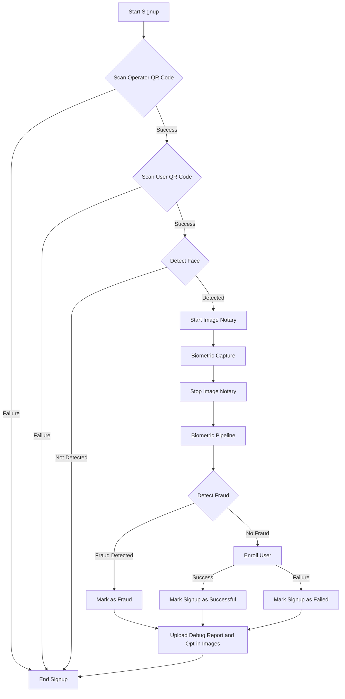

# Orb Core

`orb-core` contains the core rust application responsible for verifying users'
World IDs.

The binaries controlling the orb are found in `src/bin/`:

- src/bin/orb-core.rs: the production binary, which runs verifications in the
  field.
- src/bin/orb-backend-connect.rs: a binary to ensure backend connectivity by
  scanning a WiFi QR code and establishing the WiFi connection as long as the
  backend is not reachable.

## Code Overview

<iframe width="560" height="315"
    src="https://www.youtube.com/embed/h6AjLyj6ics?si=Z2zlweF1nW03qHFb"
    title="YouTube video player" frameborder="0" allow="accelerometer;
    autoplay; clipboard-write; encrypted-media; gyroscope; picture-in-picture;
    web-share" referrerpolicy="strict-origin-when-cross-origin"
    allowfullscreen></iframe>

Overview of the `do_signup` function:

## State of open sourcing

There are *two* orb-cores: the public one at [worldcoin/orb-core][pub repo] and
the private one at [worldcoin/priv-orb-core][priv repo]. Today, the public repo
is a manually stripped down version of the private one. This is done to remove
code paths that could reveal the types of fraud detection that we perform. Long
term, we plan to un-fork these two repos such that the public code lives in
[worldcoin/orb-software][orb-software] and the private code is only minimal
additional code, which consumes the public code as a dependency. This will
ensure that most code we develop is done directly in the open, where `main`
lives in a public repo.

See [how we do open source][open source] for more context.

[pub repo]: https://github.com/worldcoin/orb-core
[priv repo]: https://github.com/worldcoin/priv-orb-core
[orb-software]: https://github.com/worldcoin/orb-software
[open source]: ../../open-source.md
