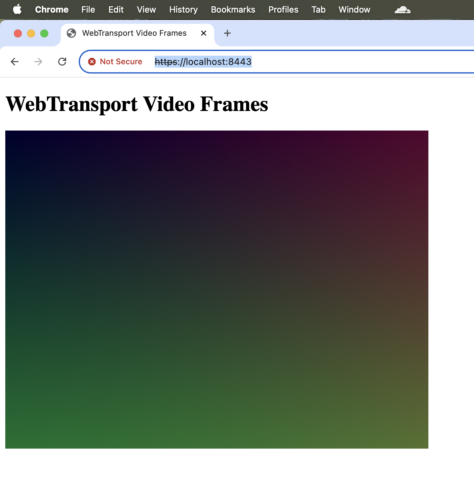

# WebTransport Video Demo

This demo showcases displaying a video feed in the browser.
It uses the [WebTransport][WebTransport] as the transport mechanism, which is a browser
api that provides access to [QUIC][QUIC] primitives.

There are two parts: A vanilla-browser-js client, and a rust server. The rust
server encodes a video feed as a series of png images [^1], and sends each frame over a 
[unidirectional stream][open_uni].

## Running the demo

Run `cargo run -p wt_video --release` and then open https://localhost:8443/ in 
Google Chrome[^2]. Be sure to accept the risk for self-signed certificates.

[^1]: The performance of the demo is lacking, because software PNG encoding is used
instead of hardware h264, h265, or AV1 video encoding. The actual production version
of a livestream system ought to use either gstreamer for encoding or [NVEC][NVENC] directly,
and the browser should decode via the [WebCodecs][WebCodecs] API.
[^2]: For now, only google chrome is supported. WebTransport is 
[supposed][WebTransport Compatibility] to work in Firefox as well, but I wasn't
initially able to figure out why it wasn't working. Note that WebTransport does not yet
have Safari support, but no one uses that XD.

[NVENC]: https://developer.nvidia.com/video-codec-sdk
[QUIC]: https://datatracker.ietf.org/doc/html/rfc9000
[WebCodecs]: https://developer.mozilla.org/en-US/docs/Web/API/WebCodecs_API
[WebTransport Compatibility]: https://developer.mozilla.org/en-US/docs/Web/API/WebTransport#browser_compatibility
[WebTransport]: https://developer.mozilla.org/en-US/docs/Web/API/WebTransport
[open_uni]: https://docs.rs/wtransport/0.5.0/wtransport/struct.Connection.html#method.open_uni
