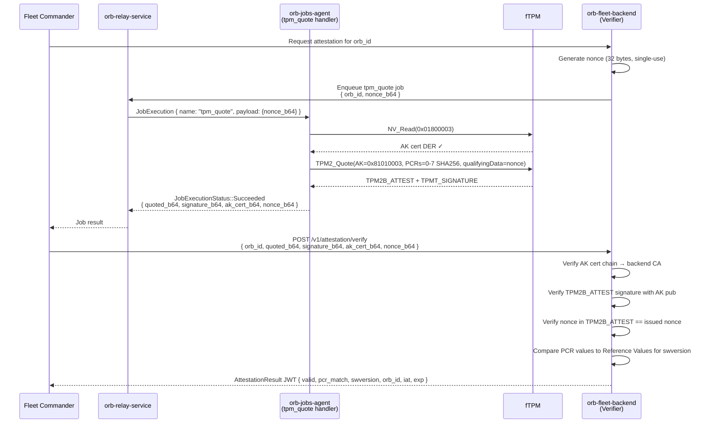
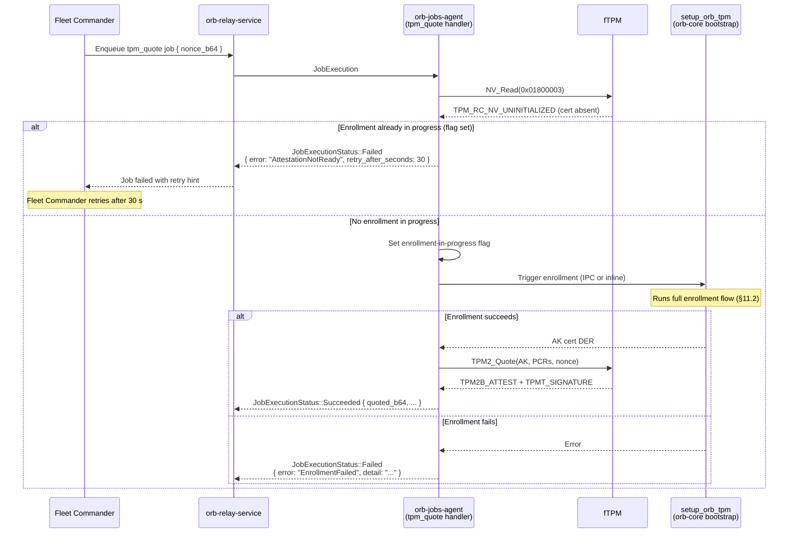

# fTPM Attestation: Key Hierarchy, Enrollment & Re-provisioning Design

> **Context:** Orb device has an fTPM whose Primary Seed is deterministic (tied to
> silicon HUK). The backend knows the per-device seed and can derive EK public keys
> offline. EK enrollment authentication relies solely on comparing the presented EK
> pub against the expected value derived from the per-device seed — no EK certificate
> and no TA signing is required for AK enrollment.

---

## 1. Why the seed makes Primary keys deterministic

A TPM2 Primary key is derived — not randomly generated — by the TPM's internal KDF:

```raw
Primary_Key = KDF(Primary_Seed, template_fields)
```

Fields that feed the KDF: `nameAlg`, `objectAttributes`, `authPolicy`, `parameters`
(algorithm/curve/scheme), and `unique` forced to all-zeros ("well-known" template).

For the Orb fTPM (ARM TrustZone fTPM), the Primary Seed is sealed to the HUK.
If NV storage is wiped but the HUK survives, `TPM2_CreatePrimary` with the identical
well-known template always reproduces the same key pair.

**Practical consequence:**
- `EK  = CreatePrimary(Endorsement hierarchy, ECC_EK_well_known_template)` → same ECC key pair every
  boot, regardless of NV loss.
- `SRK = CreatePrimary(Owner hierarchy, SRK_well_known_template)` → same SRK every boot.
- **Child keys created with `TPM2_Create` are NOT deterministic** — they use random internal
  entropy. The AK must be either persisted to a handle or re-certified on every boot.

---

## 2. Key handle layout

| Handle | Hierarchy | Key | TCG standard |
|---|---|---|---|
| `0x81010001` | Endorsement | ECC P-256 EK | TCG EK Credential Profile §2.2.1.5 |
| `0x81010003` | Endorsement | AK (Attestation Key) | TCG IWG AK Certificate §3 |
| NV `0x01800003` | — | AK certificate (DER) | owner-defined range (0x01800000–0x01BFFFFF) |

> **Note**: `0x01C000xx` is TCG-reserved for manufacturer EK certificates — do not
> use that range for service-issued AK certs.

---

## 3. ECC EK well-known template (TCG EK Credential Profile v2.5)

```raw
objectAttributes = fixedTPM | fixedParent | sensitiveDataOrigin
                 | adminWithPolicy | restricted | decrypt
authPolicy       = SHA-256("") = 0xe3b0c44298fc1c149afb4c8996fb92427ae41e4649
                   b934ca495991b7852b855
symmetric        = AES-128-CFB
scheme           = NULL  (key agreement, not direct signing)
curveID          = NIST P-256
kdf              = NULL
unique.x/y       = 32 zero bytes  <- forces deterministic derivation
```

**Important:** the ECC EK has `decrypt`, not `sign`. It participates in
`ActivateCredential` (ECDH-based key transport) but cannot sign quotes directly.
The AK, loaded under the SRK, is what signs TPM2 quotes.

---

## 4. Backend EK derivation: per-device seed model

The backend stores one secret per device: the **primary seed** (or a device-specific
value from which the seed is derived). From this it can run the same KDF the fTPM
runs and produce the expected EK public key offline — no device interaction needed.

### Why this is safe

- The seed never leaves the backend and never transits the network.
- The backend computes `EK_pub_expected(seed, well_known_template)` at provisioning
  time and stores the result.
- When the device presents `EK_pub`, the backend checks `EK_pub == EK_pub_expected`.
  Any mismatch rejects the enrollment immediately.


---

## 5. AK cert storage: TPM NV + re-provisioning on NV loss

### Normal state

The AK certificate lives in TPM NV at `0x01800003` (owner-defined range). This survives
OS reflash and filesystem wipes. It is lost only when TPM NV is explicitly cleared
(factory reset, certain firmware updates, hardware replacement).

### On NV loss: AK re-provisioning

Because the AK is built with `TPM2_Create` (random key, not deterministic), NV loss
produces a new AK with a new `name`. The old AK cert is invalid for the new AK.

The re-provisioning flow uses the EK as the stable trust anchor:

```raw
1. Device detects AK cert missing from NV
2. Device recreates AK (new random key), persists to 0x81000002
3. Device presents: { new_AK_pub, EK_pub, device_id }
4. Backend:
   a. Looks up EK_pub_expected(seed, device_id) — does not need device to send EK cert
   b. Verifies EK_pub matches
   c. Runs MakeCredential(EK_pub, new_AK_name, secret) -> (credentialBlob, encryptedSecret)
5. Backend → Device: { credentialBlob, encryptedSecret }
6. Device: ActivateCredential(AK_handle, EK_handle, ...) -> recovered_secret
      NOTE: this requires PolicySecret(Endorsement) session — see §6
7. Device → Backend: { recovered_secret }
8. Backend verifies secret match -> issues new AK cert
9. Device writes new AK cert to NV 0x01800003
```

The key property: the backend never needs to trust the device's file system or even
its TPM NV. The EK seed derivation + ActivateCredential proof together guarantee the
AK lives in the correct physical TPM.

---

## 6. PolicySecret(Endorsement) — required for ActivateCredential with EK

### The problem

The ECC EK well-known template sets `objectAttributes.adminWithPolicy = true` and
provides a well-known `authPolicy`. This means authorization of EK operations goes
through a **policy session**, not a simple password session.

The current `orb-tpm` code uses:

```rust
ctx.execute_with_session(Some(AuthSession::Password), |ctx| { ... })
```

`AuthSession::Password` maps to `ESYS_TR_PASSWORD` — the TPM's implicit password
session. This works for **Owner hierarchy** operations (SRK creation, AK creation,
`TPM2_Quote`). It will **fail** for `ActivateCredential` against the EK because the
EK requires the Endorsement hierarchy policy.

### The correct auth for ActivateCredential

The EK well-known policy is `PolicySecret(Endorsement, ...)`. In `tss-esapi` terms:

```rust
// 1. Start a trial (or HMAC) policy session
let session = ctx.start_auth_session(
    None,
    None,
    None,
    SessionType::Policy,
    SymmetricDefinition::AES_128_CFB,
    HashingAlgorithm::Sha256,
)?;

// 2. Apply PolicySecret bound to the Endorsement hierarchy auth
//    ESYS_TR_ENDORSEMENT is the permanent handle for the Endorsement hierarchy.
ctx.policy_secret(
    session.unwrap(),
    AuthorizationHandle::Endorsement,  // nonce_tpm, cp_hash, policy_ref all empty
    Default::default(),
    Default::default(),
    Default::default(),
    None,
)?;

// 3. Use the policy session as the second session when calling ActivateCredential
//    (first session covers the AK handle, second covers the EK handle)
ctx.execute_with_sessions(
    (Some(AuthSession::Password), Some(session.unwrap()), None),
    |ctx| {
        ctx.activate_credential(ak_handle, ek_handle, credential_blob, encrypted_secret)
    },
)?;
```

### Why `TPM2_Quote` does not have this problem

`TPM2_Quote` is authorized by the AK handle, which lives under the Owner hierarchy.
The AK was created with `userWithAuth` and no auth value set, so `AuthSession::Password`
(empty password) is sufficient. The EK is not involved in the quoting path at all.

### Summary table

| Operation | Handle being authorized | Required session type |
|---|---|---|
| `CreatePrimary` (SRK, Owner) | Owner hierarchy | `AuthSession::Password` |
| `Create` (AK under SRK) | SRK, Owner hierarchy | `AuthSession::Password` |
| `Load` (AK into TPM) | SRK | `AuthSession::Password` |
| `Quote` | AK | `AuthSession::Password` |
| `ActivateCredential` (EK side) | EK, Endorsement hierarchy | `PolicySecret(Endorsement)` |
| `EvictControl` | Owner hierarchy | `AuthSession::Password` |

---

## 7. EK pub on backend — no EK cert required for enrollment

The Orb fTPM does not currently have an EK certificate chain (no manufacturing CA
issues one at this time). The backend derives the EK public key from the per-device
seed and stores it in the device registry. This is sufficient for AK enrollment:

```raw
Provisioning (once, at manufacturing):
  backend.registry[device_id].ek_pub_expected = KDF(seed, ek_well_known_template)

AK enrollment — device sends: { device_id, ek_pub, ak_pub }

Backend:
  1. Look up ek_pub_expected from registry[device_id]
  2. Verify ek_pub == ek_pub_expected       (seed-derived; no cert chain needed)
  3. TPM2_MakeCredential(ek_pub, ak_name, secret)
  4. Return { cred_blob, encrypted_secret } to device

Device: ActivateCredential → recovers secret → sends back → backend issues AK cert
```

`TPM2_MakeCredential` requires only the EK **public key** — not a certificate.
The security guarantee is that `ActivateCredential` can only succeed on a device
whose fTPM actually holds the corresponding EK private key (bound to the HUK via
the seed). The seed-to-EK-pub derivation replaces the role normally played by a
manufactured EK certificate chain.

### Future: EK cert issuance

When manufacturing begins issuing EK certificates, the enrollment flow gains an
additional verification step (cert chain validation) without changing the protocol
structure. The backend transitions from seed-derived EK pub comparison to cert-chain
validation at that point.

---

## 8. Boot-time activation pseudo-code (updated)

```bash
#!/usr/bin/env bash
# TPM2 boot activation + enrollment for the Orb fTPM.
# Executed by a startup service on every boot.

set -euo pipefail

BACKEND_URL="https://attestation.internal.example.com"
EK_HANDLE=0x81010001   # TCG EK persistent handle (ECC P-256)
SRK_HANDLE=0x81000001
AK_HANDLE=0x81010003   # AIK persistent handle
AK_NV_CERT=0x01800003  # AK cert NV index — owner-defined range

DEVICE_ID=$(cat /proc/device-tree/serial-number 2>/dev/null || cat /etc/orb-id)

# -- Phase 1: EK (always deterministic, skip if already persisted) ------------

if ! tpm2_readpublic -c "$EK_HANDLE" -o /tmp/ek.pub 2>/dev/null; then
    tpm2_createprimary -C e --template ecc-ek -c /tmp/ek.ctx
    tpm2_evictcontrol  -C o -c /tmp/ek.ctx "$EK_HANDLE"
    rm -f /tmp/ek.ctx
fi
tpm2_readpublic -c "$EK_HANDLE" -o /tmp/ek.pub -f pem -o /tmp/ek_pub.pem

# -- Phase 2: SRK (deterministic) --------------------------------------------

if ! tpm2_readpublic -c "$SRK_HANDLE" 2>/dev/null; then
    tpm2_createprimary -C o -G ecc256:aes128cfb -c /tmp/srk.ctx
    tpm2_evictcontrol  -C o -c /tmp/srk.ctx "$SRK_HANDLE"
    rm -f /tmp/srk.ctx
fi

# -- Phase 3: AK (random — re-create only if missing) ------------------------

AK_NEEDS_ENROLLMENT=false

if ! tpm2_readpublic -c "$AK_HANDLE" -o /tmp/ak.pub 2>/dev/null; then
    tpm2_create      -C "$SRK_HANDLE" -G ecc256:ecdsa:null \
                     -u /tmp/ak.pub -r /tmp/ak.priv
    tpm2_load        -C "$SRK_HANDLE" -u /tmp/ak.pub -r /tmp/ak.priv -c /tmp/ak.ctx
    tpm2_evictcontrol -C o -c /tmp/ak.ctx "$AK_HANDLE"
    rm -f /tmp/ak.ctx /tmp/ak.priv
    AK_NEEDS_ENROLLMENT=true
fi
tpm2_readpublic -c "$AK_HANDLE" -o /tmp/ak.pub

# -- Phase 4: AK cert enrollment (ActivateCredential) -----------------------
# EK cert lives on backend — device does not need to send or store it.
# Backend looks it up by device_id.

if [[ "$AK_NEEDS_ENROLLMENT" == true ]] || ! tpm2_nvread "$AK_NV_CERT" -o /tmp/ak_cert.der 2>/dev/null; then

    AK_PUB_B64=$(base64 -w0 /tmp/ak.pub)
    EK_PUB_B64=$(base64 -w0 /tmp/ek.pub)

    # Step 1: send AK_pub + EK_pub to backend.
    # No device-generated nonce is needed here. The enrollment security comes
    # entirely from TPM2_MakeCredential: the backend picks a random secret, wraps
    # it for this device's EK+AK, and only ActivateCredential on the correct fTPM
    # can recover it. The challenge is entirely backend-generated.
    CHALLENGE=$(curl -sf -X POST "$BACKEND_URL/v1/attestation/ak/challenge" \
        -H "Content-Type: application/json" \
        -d "{\"device_id\":  \"$DEVICE_ID\",
             \"ek_pub_b64\": \"$EK_PUB_B64\",
             \"ak_pub_b64\": \"$AK_PUB_B64\"}")

    echo "$CHALLENGE" | jq -r .credential_blob_b64  | base64 -d > /tmp/cred.blob
    echo "$CHALLENGE" | jq -r .encrypted_secret_b64 | base64 -d > /tmp/enc.secret

    # Step 2: ActivateCredential.
    # IMPORTANT: EK authorization requires PolicySecret(Endorsement) session.
    # tpm2-tools handles this automatically when -C is the EK handle;
    # in tss-esapi you must start a PolicySession + call policy_secret(Endorsement).
    tpm2_activatecredential \
        -c "$AK_HANDLE" \
        -C "$EK_HANDLE" \
        -i /tmp/cred.blob \
        -s /tmp/enc.secret \
        -o /tmp/recovered_secret.bin

    SECRET_B64=$(base64 -w0 /tmp/recovered_secret.bin)

    # Step 3: send recovered secret back; backend issues AK cert
    AK_CERT_B64=$(curl -sf -X POST "$BACKEND_URL/v1/attestation/ak/complete" \
        -H "Content-Type: application/json" \
        -d "{\"device_id\": \"$DEVICE_ID\", \"secret_b64\": \"$SECRET_B64\"}" \
        | jq -r .ak_cert_b64)

    echo "$AK_CERT_B64" | base64 -d > /tmp/ak_cert.der
    tpm2_nvwrite "$AK_NV_CERT" -i /tmp/ak_cert.der

    rm -f /tmp/cred.blob /tmp/enc.secret /tmp/recovered_secret.bin
fi

echo "TPM activation complete."
echo "  EK  persisted at $EK_HANDLE"
echo "  SRK persisted at $SRK_HANDLE"
echo "  AK  persisted at $AK_HANDLE"
echo "  AK cert in NV at $AK_NV_CERT"
echo "  EK pub held by backend (seed-derived; no EK cert issued yet)"

# -- Phase 5: Attestation quote (called on demand, not at boot) --------------
# orb_tpm::quote(nonce) in Rust uses the persistent AK at 0x81000002.
# AuthSession::Password is sufficient here (AK is Owner-hierarchy, userWithAuth).
```

> **Note on §8 vs §8a**: The script above uses `tpm2_create` + SRK parent, which omits
> the `PolicySecret(Endorsement)` load-time binding. See §8a below for the corrected
> implementation using `tpm2_createak` (EK parent) that follows the tpm2-software
> remote attestation guidance and keylime conventions.


---

## 8a. Simplified tpm2-tools implementation (recommended)

Reference: [Remote Attestation With tpm2-tools](https://tpm2-software.github.io/2020/06/12/Remote-Attestation-With-tpm2-tools.html)

This replaces the §8 pseudo-code with the correct, minimal implementation using
`tpm2_createek` and `tpm2_createak` — the two dedicated tools from the tpm2-software
project that set all TCG-required attributes automatically. The AK is created under
the **EK** (endorsement hierarchy), so loading the AK requires a
`PolicySecret(Endorsement)` session, cryptographically binding it to the fTPM's EK.

### 8a.1 Comparison of approaches

| Aspect | §8 (`tpm2_create` + SRK) | §8a (`tpm2_createak` + EK) |
|---|---|---|
| AK parent | SRK (owner hierarchy) | EK (endorsement hierarchy) |
| AK load auth | `AuthSession::Password` | `PolicySecret(Endorsement)` |
| AK attributes | Manually specified | TCG-standard via `tpm2_createak` |
| EK↔AK binding at load | No TPM enforcement | Enforced by endorsement policy |
| Keylime compatible | No | Yes |
| tpm2-tools guideline | Diverges | Follows |

### 8a.2 Key creation script

```bash
#!/usr/bin/env bash
# orb-tpm-provision.sh — EK + AK provisioning using tpm2_createek / tpm2_createak.
# Follows: https://tpm2-software.github.io/2020/06/12/Remote-Attestation-With-tpm2-tools.html
# Runs as orb-tpm-provision.service on first boot (after ftpm_is_ready.target).
#
# TCTI: tpm2-tools reads TPM2TOOLS_TCTI from the environment.
# The systemd unit sets TPM2TOOLS_TCTI=device:/dev/optee_ftpmrm so all commands
# reach the OP-TEE fTPM via its resource manager device node.

set -euo pipefail

BACKEND_URL="https://attestation.worldcoin.dev"
EK_HANDLE=0x81010001   # TCG EK persistent handle (ECC P-256)
AK_HANDLE=0x81010003   # AIK persistent handle
AK_CERT_NV=0x01800003  # AK cert NV index — owner-defined range (not TCG-reserved 0x01C000xx)
STATE_DIR=/run/orb-tpm  # tmpfs; created and mode-0700 by systemd RuntimeDirectory=
AK_PUB="$STATE_DIR/ak.pub"
AK_NAME="$STATE_DIR/ak.name"

DEVICE_ID=$(cat /proc/device-tree/serial-number 2>/dev/null || cat /etc/orb-id)

mkdir -p "$STATE_DIR"
chmod 700 "$STATE_DIR"

# ── Phase 1: EK ──────────────────────────────────────────────────────────────
# tpm2_createek uses the TCG EK template (ECC-P256).
# The EK is deterministic — same seed always produces the same key.
# Skip if already persisted at the well-known handle.

if tpm2_readpublic -c "$EK_HANDLE" -o "$STATE_DIR/ek.pub" 2>/dev/null; then
    echo "[orb-tpm] EK already at $EK_HANDLE"
else
    echo "[orb-tpm] Creating EK..."
    tpm2_createek \
        --ek-context    "$STATE_DIR/ek.ctx" \
        --key-algorithm ecc \
        --public        "$STATE_DIR/ek.pub"
    tpm2_evictcontrol -c "$STATE_DIR/ek.ctx" "$EK_HANDLE"
    rm -f "$STATE_DIR/ek.ctx"
    echo "[orb-tpm] EK persisted at $EK_HANDLE"
fi

# ── Phase 2: AK ──────────────────────────────────────────────────────────────
# tpm2_createak creates an ECC-P256 restricted signing key under the EK.
# ActivateCredential later will automatically set up PolicySecret(Endorsement).
# In Rust (tss-esapi) use tss_esapi::abstraction::ak::{create_ak, load_ak}.

AK_NEEDS_ENROLLMENT=false

if tpm2_readpublic -c "$AK_HANDLE" -o "$AK_PUB" -n "$AK_NAME" 2>/dev/null; then
    echo "[orb-tpm] AK already at $AK_HANDLE"
else
    echo "[orb-tpm] Creating AK..."
    tpm2_createak \
        --ek-context     "$EK_HANDLE" \
        --ak-context     "$STATE_DIR/ak.ctx" \
        --key-algorithm  ecc \
        --hash-algorithm sha256 \
        --signing-algorithm ecdsa \
        --public         "$AK_PUB" \
        --private        "$STATE_DIR/ak.priv" \
        --ak-name        "$AK_NAME"
    tpm2_evictcontrol -c "$STATE_DIR/ak.ctx" "$AK_HANDLE"
    rm -f "$STATE_DIR/ak.ctx" "$STATE_DIR/ak.priv"
    AK_NEEDS_ENROLLMENT=true
    echo "[orb-tpm] AK persisted at $AK_HANDLE"
fi

# ── Phase 3: AK cert enrollment ───────────────────────────────────────────────

if [[ "$AK_NEEDS_ENROLLMENT" == false ]] && \
   tpm2_nvread "$AK_CERT_NV" -o /tmp/ak_cert.der 2>/dev/null; then
    echo "[orb-tpm] AK cert already in NV $AK_CERT_NV — done."
    exit 0
fi

echo "[orb-tpm] Starting AK enrollment..."

EK_PUB_B64=$(base64 -w0 "$STATE_DIR/ek.pub")
AK_PUB_B64=$(base64 -w0 "$AK_PUB")
AK_NAME_HEX=$(xxd -p -c 256 "$AK_NAME")

# Step 1: Request MakeCredential challenge from backend
CHALLENGE=$(curl -sf -X POST "$BACKEND_URL/v1/attestation/ak/challenge" \
    -H "Content-Type: application/json" \
    -d "{\"device_id\":   \"$DEVICE_ID\",
         \"ek_pub_b64\":  \"$EK_PUB_B64\",
         \"ak_pub_b64\":  \"$AK_PUB_B64\",
         \"ak_name_hex\": \"$AK_NAME_HEX\"}")

echo "$CHALLENGE" | jq -r .credential_blob_b64  | base64 -d > /tmp/cred.blob
echo "$CHALLENGE" | jq -r .encrypted_secret_b64 | base64 -d > /tmp/enc.secret

# Step 2: ActivateCredential.
# tpm2_activatecredential automatically starts a PolicySecret(Endorsement)
# session to satisfy the EK authorization — no manual session setup needed here.
echo "[orb-tpm] Running ActivateCredential..."
tpm2_activatecredential \
    --credentialedkey-context "$AK_HANDLE" \
    --credentialkey-context   "$EK_HANDLE" \
    --credential-blob         /tmp/cred.blob \
    --certinfo-data           /tmp/recovered_secret.bin

SECRET_B64=$(base64 -w0 /tmp/recovered_secret.bin)

# Step 3: Return recovered secret; backend issues signed AK cert
echo "[orb-tpm] Completing enrollment..."
AK_CERT_B64=$(curl -sf -X POST "$BACKEND_URL/v1/attestation/ak/complete" \
    -H "Content-Type: application/json" \
    -d "{\"device_id\":  \"$DEVICE_ID\",
         \"secret_b64\": \"$SECRET_B64\"}" \
    | jq -r .ak_cert_b64)

echo "$AK_CERT_B64" | base64 -d > /tmp/ak_cert.der
tpm2_nvwrite "$AK_CERT_NV" -i /tmp/ak_cert.der

rm -f /tmp/cred.blob /tmp/enc.secret /tmp/recovered_secret.bin /tmp/ak_cert.der
echo "[orb-tpm] Enrollment complete. AK cert stored at NV $AK_CERT_NV"
```

### 8a.3 Attestation quote (on demand, called by orb-jobs-agent)

```bash
#!/usr/bin/env bash
# orb-tpm-quote.sh <nonce_hex> [pcr_selection]
# Produces a tpm_quote job result (§14.2 JSON schema).
# Example: orb-tpm-quote.sh abcd1234... sha256:0,1,2,3,4,5,6,7

set -euo pipefail

NONCE_HEX="${1:?nonce_hex required}"
PCR_SEL="${2:-sha256:0,1,2,3,4,5,6,7}"
AK_HANDLE=0x81010003
OUT=$(mktemp -d)
trap 'rm -rf "$OUT"' EXIT

# tpm2_quote takes a binary qualifying-data file
echo "$NONCE_HEX" | xxd -r -p > "$OUT/nonce.bin"

tpm2_quote \
    --key-context    "$AK_HANDLE" \
    --pcr-list       "$PCR_SEL" \
    --qualification  "$OUT/nonce.bin" \
    --message        "$OUT/quote.bin" \
    --signature      "$OUT/sig.bin" \
    --hash-algorithm sha256

DEVICE_ID="$(cat /proc/device-tree/serial-number 2>/dev/null || cat /etc/orb-id)"
HW_VER="$(cat /etc/orb-hardware-version 2>/dev/null || echo unknown)"
FW_VER="$(cat /etc/orb-firmware-version 2>/dev/null || echo unknown)"

NONCE_B64="$(echo "$NONCE_HEX" | xxd -r -p | base64 -w0)"
QUOTED_B64="$(base64 -w0 "$OUT/quote.bin")"
SIG_B64="$(base64 -w0 "$OUT/sig.bin")"

TS="$(date -u +%Y-%m-%dT%H:%M:%SZ)"```

PY_EOF

_NONCE_B64="$NONCE_B64" _QUOTED_B64="$QUOTED_B64" _SIG_B64="$SIG_B64" \}))

_DEVICE_ID="$DEVICE_ID" _HW_VER="$HW_VER" _FW_VER="$FW_VER" _TS="$TS" \    "timestamp": os.environ["_TS"],

python3 - <<'PY_EOF'    },

import os, json        "firmware_version": os.environ["_FW_VER"],

print(json.dumps({        "hardware_version": os.environ["_HW_VER"],

    "schema_version": 1,        "orb_id":           os.environ["_DEVICE_ID"],

    "nonce_b64":      os.environ["_NONCE_B64"],    "device_info": {

    "quoted_b64":     os.environ["_QUOTED_B64"],    "signature_b64":  os.environ["_SIG_B64"],

> **Backend verification** uses `tpm2_checkquote --public ak.pub --message quote.bin
> --signature sig.bin --qualification nonce.bin` (or the Rust/tss-esapi equivalent).

---

## 8b. Systemd service: `orb-tpm-provision.service`

Files created in the repo:
- `orb-tpm/debian/orb-tpm.worldcoin-tpm-provision.service` — systemd unit
- `orb-tpm/scripts/orb-tpm-provision.sh` — provisioning script (installed as `/usr/local/bin/orb-tpm-provision`)
- `orb-tpm/scripts/orb-tpm-quote.sh` — on-demand quote script

### 8b.1 Why no sentinel file

The previous design used `ConditionPathExists=!/usr/persist/.provisioned` but
`/usr/persist` (the device's persistent partition) is flaky — it may not be
available or may be cleared independently of the TPM NV. A sentinel file on
`/usr/persist` would desync from the actual TPM and backend state.

Instead, the script checks **real provisioning state** directly on every boot:

1. `tpm2_nvread $AK_CERT_NV` — is the AK cert present in TPM NV?
2. `GET /v1/attestation/ak/status` — does the backend have this AK registered?

If both pass, the script exits in < 1 second. If either fails (NV lost, backend
lost the record, new AK needed), enrollment is re-triggered automatically.
This makes the service self-healing without any external sentinel.

### 8b.2 Service unit (`orb-tpm/debian/orb-tpm.worldcoin-tpm-provision.service`)

```ini
[Unit]
Description=Orb fTPM EK/AK Provisioning
After=ftpm_is_ready.target persistent.target network-online.target
Requires=ftpm_is_ready.target
Wants=network-online.target

# No ConditionPathExists — /usr/persist is flaky.
# The script checks TPM NV + backend registration state directly.

[Service]
Type=oneshot
RemainAfterExit=yes
ExecStart=/usr/local/bin/orb-tpm-provision

# Route tpm2-tools to the OP-TEE fTPM resource manager node.
# /dev/optee_ftpmrm is a stable symlink created by ftpm_is_ready.target.
Environment="TPM2TOOLS_TCTI=device:/dev/optee_ftpmrm"
Environment="RUST_BACKTRACE=1"

User=orb-tpm-provision
Group=orb-tpm-provision
# tss group grants access to /dev/optee_ftpmrm (udev: OWNER="tss", GROUP="tss").
SupplementaryGroups=tss

# systemd creates /run/orb-tpm owned by orb-tpm-provision:orb-tpm-provision, mode 0700.
RuntimeDirectory=orb-tpm

RuntimeDirectoryMode=0700```

RuntimeDirectoryPreserve=noWantedBy=multi-user.target

[Install]

PrivateTmp=yes

NoNewPrivileges=yesSyslogIdentifier=worldcoin-tpm-provision

### 8b.3 Fast-path logic (idempotent, runs every boot)

```raw
Boot
 │
 ├─ tpm2_nvread AK_CERT_NV             ← TPM NV check (< 100 ms)
 │   └─ FAIL → go to enrollment
 │
 ├─ GET /v1/attestation/ak/status      ← backend registration check (~200 ms)
 │   └─ non-200 → go to enrollment
 │
 └─ EXIT 0  (fast path, ~1 s total)

Enrollment:
  tpm2_createek (skip if EK at 0x81010001)
  tpm2_createak (skip if AK at 0x81010003, set AK_NEEDS_ENROLLMENT=true)
  POST /challenge → tpm2_activatecredential → POST /complete → tpm2_nvwrite
```

### 8b.4 Dependency graph

```raw
ftpm_is_ready.target          (orb-os — /dev/optee_ftpmrm symlink exists)
        │
        ▼
orb-tpm-provision.service     (worldcoin-tpm-provision)
  Fast path  : TPM NV read + backend status check → exit 0 in ~1 s
  Slow path  : tpm2_createek + tpm2_createak + ActivateCredential enrollment
        │
        ▼
orb-jobs-agent.service        (Wants=worldcoin-tpm-provision.service)
  Calls orb-tpm-quote.sh on quote request
```

### 8b.5 fTPM device node

`/dev/optee_ftpmrm` is a stable symlink created by `ftpm_is_ready.target` in orb-os
pointing to the OP-TEE fTPM resource manager char device. `TPM2TOOLS_TCTI=device:/dev/optee_ftpmrm`
ensures all `tpm2_*` commands target the OP-TEE fTPM exclusively.

### 8b.6 State storage

| Data | Location | Rationale |
|---|---|---|
| EK public key | TPM NV (handle `0x81010001`) | Deterministic; no need to persist elsewhere |
| AK public + private blobs | TPM NV (persistent handle `0x81010003`) | Survives OS reflash; lost only on TPM NV clear |
| AK certificate | TPM NV (`0x01800003`) | Same lifecycle as AK; re-enrolled on next boot if lost |
| Working files during provisioning | `/run/orb-tpm` (tmpfs) | Cleaned up on exit; never written to `/usr/persist` |
---

## 9. Open questions resolved

| # | Question | Resolution |
|---|---|---|
| 1 | Where does AK cert live? | TPM NV `0x01800003` (owner-defined range). Re-provisioned via ActivateCredential if lost. |
| 2 | EK policy auth for ActivateCredential | Requires `PolicySecret(Endorsement)` policy session, NOT `AuthSession::Password`. Current `quote()` code is unaffected (Owner hierarchy only). A future `activate_credential()` function must set up the policy session explicitly. |
| 3 | Per-device seed or EK pub? | Backend stores seed, derives EK pub offline. The derived EK pub is compared directly against the device-presented EK pub at enrollment time. No TA signing is used. |
| 4 | EK cert? | No EK cert exists at this time. The backend validates `EK_pub` against the seed-derived expected value. When manufacturing issues EK certs in the future, the backend can add cert-chain validation as an additional step. |

---

## 10. RATS Architecture Mapping (RFC 9334)

RFC 9334 defines the RATS (Remote ATtestation procedureS) architecture with well-defined roles, artifacts, and topological models. This section maps the Orb fTPM attestation design to those concepts.

### 10.1 Role Mapping

| RATS Role | Orb Component | Notes |
|---|---|---|
| **Attester** | Orb device (fTPM + `orb-jobs-agent`) | Produces Evidence: `TPM2B_ATTEST` + `TPMT_SIGNATURE` |
| **Verifier** | `orb-fleet-backend` attestation service | Validates Evidence against Reference Values; issues Attestation Results |
| **Relying Party** | Fleet Commander UI / orchestration layer | Consumes Attestation Results to make policy decisions |
| **Endorser** | Manufacturing CA | Issues AK cert; EK pub is currently seed-derived (no EK cert yet) |
| **Reference Value Provider** | `orb-fleet-backend` / Golden Image pipeline | Maintains expected PCR digests per software version |

### 10.2 Artifact Mapping

| RATS Artifact | Orb Artifact | Format |
|---|---|---|
| Evidence | `TPM2B_ATTEST` + `TPMT_SIGNATURE` | TPM2 binary structures, base64-encoded in transit |
| Endorsements | AK certificate; EK pub (seed-derived, no EK cert yet) | X.509 DER / binary |
| Reference Values | Expected PCR 0–7 SHA-256 digests per `swversion` | JSON map stored in backend DB |
| Attestation Results | Backend-signed JWT containing verification outcome | JWT (ES256 or RS256) |
| Conveyance | `orb-relay-service` gRPC job + HTTPS enrollment API | gRPC + HTTPS |

### 10.3 Topological Model

Orb uses the **Background-Check Model** (RFC 9334, §5.2):

```raw
Orb (Attester) ──Evidence──▶ Backend (Verifier+RP)
                                   │
                Endorsements ──────┘  (from manufacturing CA; EK pub seed-derived)
                Reference Values ──┘  (from golden image pipeline)
```

The Verifier and Relying Party are co-located in `orb-fleet-backend`. The Verifier validates Evidence and immediately applies the result to policy — no separate Attestation Result token needs to cross a trust boundary in the initial implementation. An EAT-wrapped Attestation Result (§14) provides a path toward a split Verifier/RP topology in the future.

### 10.4 Freshness (RFC 9334 §10)

Nonce-based freshness (RFC 9334 §10.3) is used:

- Backend generates a cryptographically random 32-byte nonce per attestation request
- Nonce is delivered to the device via the relay job payload
- Device includes the nonce verbatim in the TPM `TPM2_Quote` command
- TPM signs the nonce inside `TPM2B_ATTEST` — it is unforgeable without the AK private key
- Backend verifies the nonce in the `TPM2B_ATTEST` before accepting the Evidence

This prevents replay of prior quotes. The nonce must be single-use; the backend must discard it after first verification.

---

## 11. AK Enrollment Flow

AK enrollment must complete before the device can participate in on-demand attestation. It runs during `orb-core` bootstrap as `setup_orb_tpm()`, which executes after `ensure_network_connection()` and before `boot_complete`. The outer retry loop in `orb-core` handles transient failures automatically.

### 11.1 Prerequisites

- fTPM is initialized and the EK is persistent at `0x81010001`
- SRK is persistent at `0x81000001`
- Device has network connectivity to `orb-fleet-backend`
- Backend has the per-device seed and can derive the expected EK pub offline

### 11.2 Sequence Diagram — Successful Enrollment

```mermaid
sequenceDiagram
    participant fTPM
    participant Agent as orb-core<br/>(setup_orb_tpm)
    participant Backend as orb-fleet-backend<br/>/v1/attestation/ak

    Note over Agent,fTPM: Step 1 — Persist EK, SRK, AK
    Agent->>fTPM: CreatePrimary(EK, Endorsement hier.)
    fTPM-->>Agent: EK handle + EK pub
    Agent->>fTPM: EvictControl → 0x81010001
    Agent->>fTPM: CreatePrimary(SRK, Owner hier.)
    fTPM-->>Agent: SRK handle
    Agent->>fTPM: EvictControl → 0x81000001
    Agent->>fTPM: Create(AK under SRK)
    fTPM-->>Agent: AK pub + AK priv
    Agent->>fTPM: Load(AK priv, AK pub)
    Agent->>fTPM: EvictControl → 0x81000002

    Note over Agent,fTPM: Step 2 — Check if already enrolled
    Agent->>fTPM: NV_Read(0x01800003)
    alt AK cert already present
        fTPM-->>Agent: AK cert DER
        Note over Agent: Enrollment complete — exit 0
    else NV index absent or empty
        fTPM-->>Agent: TPM_RC_NV_UNINITIALIZED

        Note over Agent,Backend: Step 3 — Request MakeCredential challenge<br/>(backend-generated; no device nonce needed)
        Agent->>Backend: POST /v1/attestation/ak/challenge<br/>{ orb_id, ek_pub_b64, ak_pub_b64 }
        Backend->>Backend: Verify ek_pub == seed-derived expected EK pub
        Backend->>Backend: TPM2_MakeCredential(ek_pub, ak_pub_name, secret)
        Backend-->>Agent: { cred_blob_b64, encrypted_secret_b64, challenge_id }

        Note over Agent,fTPM: Step 4 — ActivateCredential (proves EK+AK linkage)
        Agent->>fTPM: StartAuthSession(PolicySession)
        Agent->>fTPM: PolicySecret(Endorsement hierarchy)
        Agent->>fTPM: ActivateCredential(AK=0x81010003, EK=0x81010001,<br/>credentialBlob, encryptedSecret)
        fTPM-->>Agent: recovered_secret (32 bytes)

        Note over Agent,Backend: Step 5 — Complete enrollment
        Agent->>Backend: POST /v1/attestation/ak/complete<br/>{ challenge_id, recovered_secret_b64 }
        Backend->>Backend: Verify recovered_secret == original secret
        Backend->>Backend: Issue AK certificate (signed by backend CA)
        Backend-->>Agent: { ak_cert_der_b64 }

        Note over Agent,fTPM: Step 6 — Persist AK cert in TPM NV
        Agent->>fTPM: NV_DefineSpace(0x01800003, size=len(ak_cert))
        Agent->>fTPM: NV_Write(0x01800003, ak_cert_der)
        Note over Agent: Enrollment complete — exit 0
    end
```

### 11.3 Failure Handling

| Failure | Behavior |
|---|---|
| No network at boot | Exponential backoff (30 s → 60 s → 120 s, max 10 min), then retry next boot |
| Backend returns 5xx | Retry with backoff; alert after 3 consecutive failures |
| `ActivateCredential` fails | Abort current attempt; retry from Step 3 on next boot |
| NV write fails | Retry NV_DefineSpace + NV_Write; if persistent failure, flag device |
| AK already enrolled (NV present) | Skip enrollment silently (idempotent) |

---

## 12. On-Demand Attestation Flow

On-demand attestation is triggered by Fleet Commander via the relay job system (`tpm_quote` job).

### 12.1 Normal Case — AK Certificate Present



### 12.2 AK Certificate Not Yet Enrolled



---

## 13. Enrollment Service Design

AK enrollment requires two components: (1) backend HTTPS endpoints that run
`TPM2_MakeCredential` in software and issue AK certificates, and (2) a device-side
enrollment trigger integrated into `orb-core` bootstrap as `setup_orb_tpm()`.

### 13.1 Backend: HTTPS Endpoints on orb-fleet-backend

Add two REST endpoints to `orb-fleet-backend` under a new `attestation` controller.

> **Security note:** The enrollment challenge is entirely backend-generated. The
> backend picks a random secret and wraps it via
> `TPM2_MakeCredential(ek_pub, ak_name, secret)`. Only a device whose fTPM holds
> the actual EK private key can call `ActivateCredential` to recover that secret.
> No device-generated nonce is involved — the MakeCredential binding IS the challenge.

#### `POST /v1/attestation/ak/challenge`

Accepts the device's EK pub and AK pub. The backend verifies the EK pub against the
seed-derived expected value, then runs software `TPM2_MakeCredential`.

```json
// Request
{
  "orb_id": "0x1234abcd",
  "ek_pub_b64": "<TPM2B_PUBLIC base64>",
  "ak_pub_b64": "<TPM2B_PUBLIC base64>"
}

// Response 200
{
  "challenge_id": "uuid-v4",
  "cred_blob_b64": "<TPM2B_ID_OBJECT base64>",
  "encrypted_secret_b64": "<TPM2B_ENCRYPTED_SECRET base64>",
  "expires_at": "2025-01-01T00:05:00Z"
}
```

#### `POST /v1/attestation/ak/complete`

Verifies the recovered secret and issues a signed AK certificate.

```json
// Request
{
  "challenge_id": "uuid-v4",
  "recovered_secret_b64": "<32-byte secret base64>"
}

// Response 200
{
  "ak_cert_der_b64": "<X.509 AK certificate DER base64>",
  "ak_cert_pem": "-----BEGIN CERTIFICATE-----\n..."
}
```

**Rationale:**
- Stateless HTTPS is simple to implement, monitor, and scale
- Standard web infrastructure (rate limiting, WAF, audit logging)
- `TPM2_MakeCredential` is a pure software operation — no TPM required on backend
- AK certificate issuance fits naturally alongside other device registry operations
- Seed-derived EK pub verification replaces the need for TA signing or EK cert chain

### 13.2 Device Side: `setup_orb_tpm()` in orb-core Bootstrap

The device-side enrollment is integrated into `orb-core`'s bootstrap closure as
`setup_orb_tpm()`, called after `ensure_network_connection()`:

```rust
// priv-orb-core/src/bin/orb-core.rs  (bootstrap closure)
let mut bootstrap = async || {
    wifi::Plan.ensure_network_connection(&mut orb, true).await?;
    setup_orb_token(Duration::from_secs(30), Duration::from_secs(10)).await?;
    setup_orb_tpm().await?;   // ← persists EK/SRK/AK, enrolls AK cert if absent
    // ... rest of bootstrap
    eyre::Ok(())
};
```

`setup_orb_tpm()` is idempotent:
- EK/SRK/AK already persisted → skip TPM key creation
- AK cert already in NV `0x01800003` → skip enrollment
- Network or backend errors → propagate up to the `loop` which retries the whole
  bootstrap closure with a 5-second delay

This ensures `boot_complete` is only signalled after the AK is enrolled, eliminating
the "not-ready" race condition described in §12.2.

---

## 14. Attestation Response Format

### 14.1 IETF/RATS Standards for TPM Evidence Conveyance

The RATS WG (RFC 9334) and the companion **RFC 9683** (TPM-based Network Device Remote
Integrity Verification) define how TPM quotes are to be presented and transferred:

- **Evidence** = the raw TPM binary structures: `TPM2B_ATTEST` + `TPMT_SIGNATURE`.
  RFC 9683 §5.1 is explicit: *"quotes from the TPM are signed inside the TPM, and MUST
  be retrieved in a way that does not invalidate the signature."* The binary structure
  must be preserved as-is — it cannot be decomposed into JSON fields and re-encoded.
- **Attestation Log** = the **TCG Canonical Event Log**, conveyed alongside the quote.
  The log records each individual PCR extension event (hash + metadata). The Verifier
  uses the log to reconstruct and validate the PCR values against the signed quote.
  Raw PCR values alone (without the log) cannot be verified for correctness.
- **Standard wire format** = the **CHARRA YANG model** (RFC 9684,
  `draft-ietf-rats-yang-tpm-charra`) over NETCONF/RESTCONF with TLS. It passes the raw
  binary structures base64-encoded as YANG leaves.

**Why Orb does not use CHARRA**: CHARRA targets management-plane network equipment
(NETCONF-speaking routers/switches). Orb uses HTTPS + gRPC relay, not NETCONF.
CHARRA does not apply. Instead, Orb carries the same raw binary Evidence in a JSON
envelope over HTTPS, which preserves the TPM signature integrity requirement.

### 14.2 Evidence Payload (tpm_quote Job Result)

The `tpm_quote` job result carries the raw TPM binary structures base64-encoded,
consistent with the RFC 9683 requirement to preserve the TPM signature:

```json
{
  "schema_version": 1,
  "nonce_b64": "<32-byte nonce base64>",
  "quoted_b64": "<TPM2B_ATTEST binary, base64 — DO NOT decompose>",
  "signature_b64": "<TPMT_SIGNATURE binary, base64 — DO NOT decompose>",
  "ak_cert_b64": "<X.509 AK certificate DER base64>",
  "device_info": {
    "orb_id": "...",
    "hardware_version": "...",

    "firmware_version": "..."```

  },}
  "timestamp": "2025-01-01T00:00:00Z"

> **Note on PCR log**: In the initial implementation, no Canonical Event Log is
> included. The Verifier compares raw PCR values from the parsed `TPM2B_ATTEST`
> against stored Reference Values for the known software version. A full log is
> needed only when PCR values are non-deterministic (e.g., Linux IMA). Boot-phase
> PCRs 0–7 on Orb are deterministic for a given firmware build.

This payload is forwarded to the backend Verifier which validates the TPM signature
and produces an Attestation Result.

### 14.3 Attestation Result JWT (Verifier Output)

The Verifier issues a JWT signed with the backend's attestation key. The JWT carries
standard EAT identity claims (RFC 9711) plus **private Worldcoin claims** (`x-wc-`)
describing the verification outcome.

> `x-wc-attestation` is a **private claim defined by Worldcoin** — it is not part of
> any IETF standard. The EAT standard (RFC 9711) defines subject/device identity claims
> (`eat_nonce`, `ueid`, `hwmodel`, etc.) but does not prescribe what Attestation Result
> content should look like. Worldcoin defines that content freely under the `x-wc-`
> namespace.

```json
// JWT Header
{
  "alg": "ES256",
  "typ": "JWT",
  "kid": "backend-attestation-key-v1"
}

// JWT Payload
{
  // ── Standard EAT claims (RFC 9711) ──
  "eat_profile": "tag:worldcoin.org,2025:orb-attestation-v1",
  "iat": 1735689600,
  "exp": 1735693200,
  "eat_nonce": "<32-byte nonce hex>",
  "ueid": "02:00:00:00:12:34:ab:cd",
  "oemid": "Worldcoin Foundation",
  "hwmodel": "orb-gen3",
  "swversion": [
    { "version": "1.2.3", "version_scheme": "semver" }
  ],
  "dbgstat": "disabled",

  // ── Private Worldcoin attestation result (not from IETF) ──
  "x-wc-attestation": {
    "result": "pass",
    "pcr_bank": "sha256",
    "pcr_selection": [0, 1, 2, 3, 4, 5, 6, 7],
    "reference_values_version": "1.2.x",
    "ak_cert_fingerprint": "sha256:aabbccdd..."
  }
}
```

### 14.4 Standard EAT Claims Mapping

| EAT Claim (RFC 9711) | CDDL Key | Orb Value |
|---|---|---|
| `eat_profile` | 265 | `"tag:worldcoin.org,2025:orb-attestation-v1"` |
| `iat` (issued at) | 6 | Unix timestamp of Verifier issuance |
| `exp` (expiry) | 4 | `iat + 3600` (1-hour validity) |
| `eat_nonce` | 10 | The nonce from the attestation request (hex) |
| `ueid` | 256 | EUI-64 derived from orb serial number (type 0x02) |
| `oemid` | 258 | `"Worldcoin Foundation"` |
| `hwmodel` | 259 | `"orb-gen3"` (hardware generation) |
| `swversion` | 268 | Array of `{ version, version_scheme }` per component |
| `dbgstat` | 263 | `"disabled"` (JTAG/debug inaccessible in production) |

The `x-wc-attestation` object is a private claim (no CDDL key assigned). If the
format is ever submitted for standardization, these fields would be proposed as new
EAT claims via IANA registration.

### 14.5 Freshness Guarantee

The Attestation Result JWT is bound to the nonce from the original request
(`eat_nonce` == `nonce_b64` in the Evidence). This allows a Relying Party to confirm:

1. The result is fresh — the nonce was generated for this specific request
2. The Evidence is live — the TPM signed the nonce inside the chip (unforgeable)
3. The result was issued by the trusted Verifier — the JWT signature

The `exp` claim (1-hour TTL) allows caching within its validity window. Relying
Parties requiring real-time freshness must request a new attestation with a new nonce.


---

